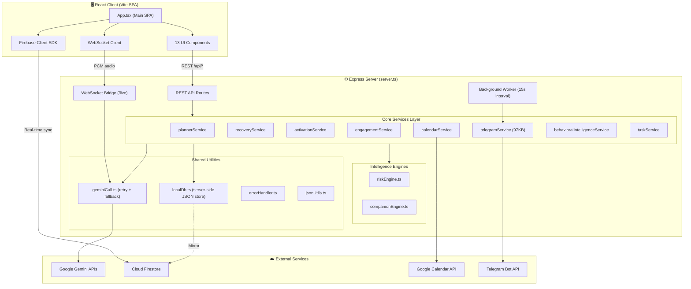
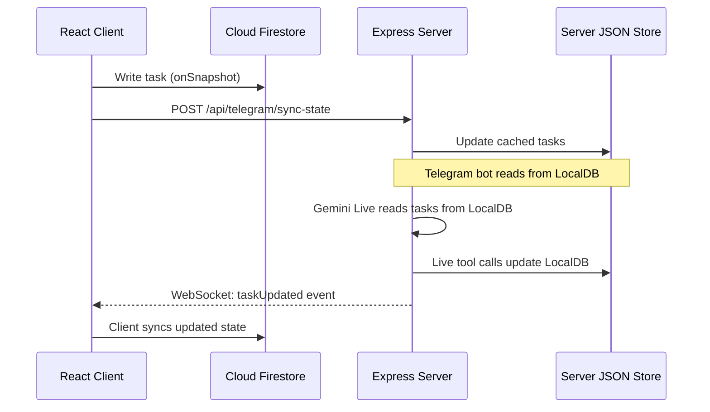
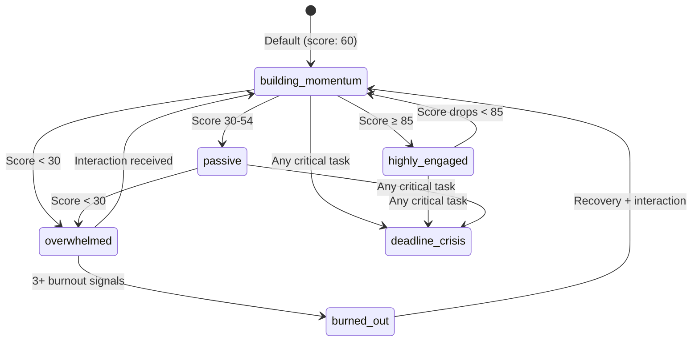

# 🏗️ System Architecture

> Deep-dive into Saarthi's system architecture, data flows, and service interactions.

[← Back to README](../README.md)

---

## Overview

Saarthi is a full-stack, real-time application with three major subsystems:

1. **React SPA** (client) — UI, Firebase real-time sync, WebSocket audio streaming
2. **Express Server** (backend) — REST API, WebSocket bridge, Telegram bot, background workers
3. **External Services** — Google Gemini APIs, Firebase, Google Calendar, Telegram

All three run on a **single port (3000)**, sharing the HTTP server via Express middleware and WebSocket `upgrade` handling.

---

## High-Level Architecture



---

## Server Architecture

### Single Entry Point

The entire backend is a single `server.ts` file (~1,158 lines) that bootstraps:

1. **Express app** with JSON body parsing (50MB limit for image uploads)
2. **HTTP server** wrapping the Express app
3. **WebSocket server** (noServer mode) for Gemini Live
4. **Vite middleware** (dev mode) or static file serving (production)
5. **Telegram long polling** on startup
6. **Background worker** for scheduled daily digest dispatching

```typescript
// Port sharing architecture
const server = http.createServer(app);      // Express HTTP
const wss = new WebSocketServer({ noServer: true }); // WebSocket

server.on("upgrade", (request, socket, head) => {
  const pathname = new URL(request.url, ...).pathname;
  if (pathname === "/live") {
    wss.handleUpgrade(request, socket, head, (ws) => {
      wss.emit("connection", ws, request);
    });
  } else {
    socket.destroy();
  }
});
```

### API Key Resolution

Every API route supports custom Gemini API keys via the `x-gemini-api-key` header:

```typescript
function getAiClient(req: express.Request): GoogleGenAI {
  const customKey = req.headers["x-gemini-api-key"] as string;
  if (customKey?.trim().length > 0) {
    return new GoogleGenAI({ apiKey: customKey.trim() });
  }
  return ai; // Default server-side key
}
```

---

## Data Architecture

### Dual Storage Strategy

Saarthi uses a **dual storage** approach:

| Store | Purpose | Technology |
|:---|:---|:---|
| **Firebase Firestore** | Client-side real-time sync, auth state, user data | Firebase Client SDK (named database) |
| **Server-side JSON** | Backend task cache, Telegram state, engagement data | `localDb.ts` (in-memory + JSON file) |

The server maintains a local JSON database (`localDb.ts`) that mirrors critical state. This enables:
- Telegram bot operations without Firebase Admin costs
- Gemini Live voice sessions to access task state
- Background workers to send daily digests

### Firestore Collections

```
/tasks/{taskId}              → Task documents (subtasks, risk, deadlines)
/userSettings/{userId}       → API keys, Telegram links, companion profiles
/userEngagement/{userId}     → Engagement scores, notification history
/userAnalytics/{userId}      → Activation analytics, streaks, momentum
/activationSessions/{id}     → Micro-mission session records
/learningProfiles/{userId}   → Behavioral learning profiles
/behavioralEvents/{id}       → Raw behavioral event log
```

### State Synchronization Flow



---

## Risk Engine Architecture

The risk engine (`riskEngine.ts`) is **fully deterministic** — no AI involved. It computes a 0-100 risk score using 5 weighted factors:

```
Risk Score = Base Undone Ratio (35)
           + Velocity Penalty (35) × Complexity Weight
           + Schedule Pressure (40) × Complexity Weight  
           + Complexity Penalty (15)
           + Missed Sessions (25)
           - Recovery Mitigation (25)
```

### Factor Breakdown

| Factor | Max Points | Signal |
|:---|:---|:---|
| **Base Undone Ratio** | 35 | `(1 - completedSubtasks / totalSubtasks) × 35` |
| **Velocity Penalty** | 35 | How far behind expected pace (timeline % vs completion %) |
| **Schedule Pressure** | 40 | Buffer ratio: remaining hours / remaining effort hours |
| **Complexity Weight** | 1.35× | Amplifies velocity + pressure for high-complexity tasks |
| **Missed Sessions** | 25 | `(missedCount × 4) + (consecutiveMissed × 6)` |
| **Recovery Mitigation** | -25 | Applied if task has an accepted recovery plan |

### Risk Zones

| Zone | Score Range | Trigger |
|:---|:---|:---|
| 🟢 **Safe** | 0–39 | Normal execution pace |
| 🟡 **Watch** | 40–69 | Falling behind expected velocity |
| 🔴 **Critical** | 70–100 | OR < 3 hours remaining with incomplete subtasks |

---

## WebSocket Architecture (Gemini Live)

The Gemini Live integration maintains a **bidirectional audio bridge** between the browser and Gemini's Live API:

### Connection Flow

1. Client opens WebSocket to `ws://localhost:3000/live?userId=xxx&key=optional`
2. Server extracts `userId` and optional custom API key from query params
3. Server loads user's tasks from `localDb` for system instruction context
4. Server opens a Gemini Live session with tool declarations
5. Bidirectional audio streaming begins

### Tool Calling in Voice Sessions

The Live session declares 3 tools:

| Tool | Parameters | Action |
|:---|:---|:---|
| `completeTask` | `taskId`, `subtaskId?` | Mark task/subtask as done |
| `snoozeTask` | `taskId`, `days` | Postpone deadline by N days |
| `getTasksStatus` | — | Retrieve current task list |

When Gemini invokes a tool, the server:
1. Executes the operation on `localDb`
2. Recomputes risk scores
3. Sends `taskUpdated` event to the client via WebSocket
4. Returns tool response to the Gemini session
5. Gemini generates verbal confirmation audio

---

## Engagement Engine Architecture

The engagement system implements a **multi-tier behavioral classification** with automatic notification back-off:



### Notification Back-off Tiers

| Tier | Consecutive Ignores | Lock Duration |
|:---|:---|:---|
| T0 | 0 | No lock |
| T1 | 1–2 | 1–2 hours |
| T2 | 3 | 6 hours |
| T3 | 4+ | 12 hours |

### Time-based Decay

If a user hasn't interacted for 24+ hours, the engagement score decays by **8 points per day** (floor: 15).

---

## Background Workers

### Daily Digest Worker

A `setInterval` (15-second tick) runs on the server to dispatch scheduled Telegram briefings:

```typescript
setInterval(() => {
  for (const userId of Object.keys(dbData.userSettings)) {
    const settings = dbData.userSettings[userId];
    if (settings.telegramChatId && settings.telegramAlertSlots) {
      // Check if current time matches any configured alert slot
      // Supports timezone-aware scheduling
      // Dispatches are de-duplicated per user per day per slot
    }
  }
}, 15000);
```

### Telegram Long Polling

On server boot, the Telegram service starts long polling (`getUpdates`) as a fallback for environments where webhook registration isn't possible (e.g., local development without HTTPS).

---

## Build Architecture

### Development Mode

```
tsx server.ts
  → TypeScript execution via tsx (no compile step)
  → Express server starts on port 3000
  → Vite dev server mounts as Express middleware
  → HMR enabled for React components
```

### Production Build

```
npm run build
  → vite build: React SPA → dist/index.html + assets
  → esbuild: server.ts → dist/server.cjs (CommonJS, external deps, sourcemaps)

npm run start
  → node dist/server.cjs
  → Express serves static files from dist/
  → API routes + WebSocket bridge active
```

---

[← Back to README](../README.md) · [API Reference →](API_REFERENCE.md)
