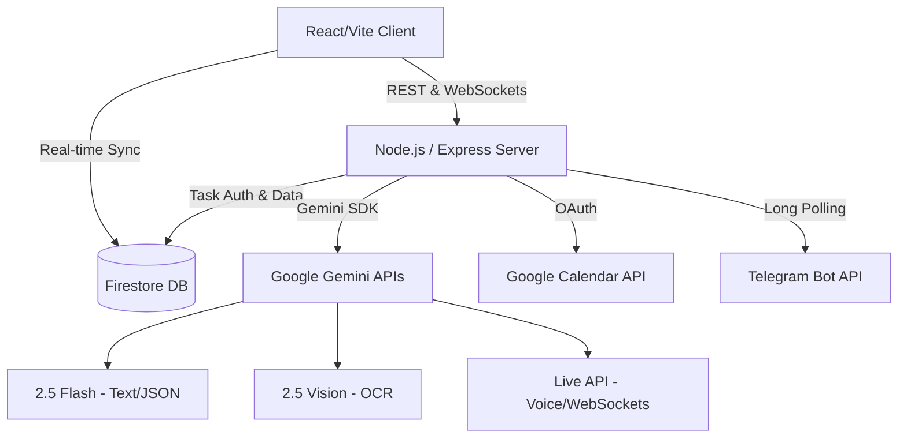

<div align="center">

# 🧭 Saarthi

**The Behavioral Execution Platform for Ambitious Knowledge Workers**

[](#)
[](https://www.typescriptlang.org/)
[](https://reactjs.org/)
[](https://vitejs.dev/)
[](https://deepmind.google/technologies/gemini/)
[](https://opensource.org/licenses/MIT)

[Live Demo](#) · [Documentation](#) · [Report Bug](#) · [Request Feature](#)

</div>

---

## 📖 The Execution Paradigm Shift

The market is saturated with software that optimizes planning. Todoist, Motion, Notion, and Google Tasks are excellent at storing information. But people rarely fail because they forgot. They fail due to procrastination, overwhelm, perfectionism, poor estimation, momentum collapse, or burnout. 

**Saarthi is an AI Execution Operating System.** It marks a fundamental category transition: from tools that organize work to an engine that ensures you *finish* it.

Traditional software manages time and information. **Saarthi manages behavior and execution.**

Powered by the **Google Gemini ecosystem** and deeply integrated with **Google Workspace** and **Telegram**, Saarthi bridges the gap between static planning and real-time completion. It is an active system that learns your behavior, predicts execution risk, and autonomously recalculates your path forward.

---

## 🚨 The Problem

Traditional productivity tools—planners, calendars, and to-do lists—make a fatal assumption: they assume humans are perfectly disciplined robots. 

- **Passive Storage:** Tasks are stored. Deadlines are recorded. But when friction spikes, no strategic breakdown is provided.
- **Unreactive Alerts:** A notification pings when it's too late. The friction of starting leads to avoidance.
- **Momentum Collapse:** When you fall behind, traditional systems just turn tasks red. The mental burden of rescheduling causes execution paralysis, leading to missed objectives or severe burnout.

### The Saarthi Philosophy
Saarthi exists to help you **finish work**, not simply organize it. It shifts the burden of planning, risk calculation, and recovery from the human to the AI, ensuring that no matter how chaotic life gets, you always have a viable, actionable path to completion.

---

## ✨ The Four Core Execution Systems

Saarthi's architecture abandons traditional to-do lists in favor of four flagship execution systems.

### 1. Adaptive Planning Engine
Saarthi autonomously decomposes massive, overwhelming goals into realistic execution plans. Instead of static schedules that break the moment you fall behind, **plans evolve daily**. It breaks down complex commitments into minute-by-minute subtasks, perfectly sized to bypass procrastination and build immediate momentum.

### 2. Execution Engine & Emotional Intelligence
Traditional apps send a cold "Task Due" ping. Saarthi recognizes overwhelm. When it detects execution paralysis or momentum loss, the Execution Engine intervenes with emotional intelligence *(e.g., "Looks like today got overwhelming. Let's rebuild tomorrow.")*. It negotiates the smallest possible step to simply help you *begin*.

### 3. Recovery OS & Decision Matrix
When life goes wrong and deadlines become mathematically impossible, Saarthi doesn't just tell you to work harder. The Recovery OS acts as a ruthless decision engine focused on what you should **not** do. It generates a Compromise Strategy *(e.g., "Deadline impossible? Drop Feature X. Finish Core. Secure the passing grade.")* to deliver maximum value in the remaining time.

### 4. Behavioral Intelligence & Memory
Saarthi continuously learns how you actually work. It monitors focus patterns, completion rates, and fatigue levels, building a private Learning Profile. Every future plan is optimized against your historical behavior *(e.g., "I noticed you usually finish coding after dinner, but every Friday your productivity drops. Let's shift this deadline.")*.

---

## 🌐 The Supporting Ecosystem & Tech Stack

These core systems are powered by a robust ecosystem of integrated technologies, built primarily on Google's AI and Cloud stack:

- **Predictive Risk Engine:** Continuously computes the mathematical probability of completion in real-time, shifting commitments between Secured, Caution, and Critical zones.
- **Google Gemini 2.5 Flash:** The core reasoning engine behind the Adaptive Planning and Behavioral Intelligence systems.
- **Google Gemini Live (WebSockets):** A low-latency integration providing real-time voice consultations. Brainstorm, update states, or overcome blocks through conversation.
- **Google Gemini Vision:** Processes complex unstructured images (syllabi, schedules) into actionable structured payloads.
- **Firebase Authentication & Cloud Firestore:** Secure, real-time database infrastructure to maintain the user's Behavioral Profile and execution state.
- **Telegram Companion Bot:** A Node.js driven integration delivering critical alerts, daily briefings, evening reflections, and interactive recovery plans directly to your phone.
- **Google Calendar Synchronization:** Extracted milestones are seamlessly provisioned and synchronized with your Google Calendar via OAuth.

---

## 🏛️ System Architecture

Saarthi is a production-grade full-stack platform engineered for scale and speed.



### AI Architecture

- **Gemini 2.5 Flash:** The core reasoning engine. Used for high-speed, structured JSON generation, task decomposition, and behavioral analysis.
- **Gemini Live API (WebSockets):** Maintains a stateful, low-latency audio stream for conversational coaching, equipped with tool-calling capabilities to modify database state autonomously.
- **Gemini 2.5 Flash Vision:** Processes complex unstructured images (syllabi, schedules) into actionable structured payloads.

---

## 💻 Technology Stack

| Domain | Technologies |
| :--- | :--- |
| **Frontend** | React 18, TypeScript, Vite, Tailwind CSS, Lucide Icons |
| **Backend** | Node.js, Express, TypeScript, tsx, esbuild |
| **AI Ecosystem** | `@google/genai` (Gemini 2.5 Flash, Vision, Live) |
| **Database & Auth** | Firebase Authentication, Cloud Firestore |
| **Integrations** | Google Workspace (Calendar APIs), Telegram Bot API |

---

## 📂 Repository Structure

```text
saarthi/
├── docs/                      # Architecture & Product Documentation
├── src/                       
│   ├── components/            # React UI Components
│   ├── lib/                   # Utility configurations (Firebase, OAuth)
│   ├── services/              # Core business logic (Behavioral Engine, AI Planners)
│   ├── App.tsx                # Main application entry point
│   ├── index.css              # Global Tailwind styling
│   └── types.ts               # Shared TypeScript interfaces
├── server.ts                  # Express backend entry point
├── firestore.rules            # Security rules for database access
├── package.json               # Build and dependency scripts
└── vite.config.ts             # Vite bundler configuration
```

---

## 🚀 Installation & Local Development

### 1. Prerequisites
- Node.js (v18+)
- Firebase Project (Firestore & Authentication enabled)
- Google Cloud Console Project (for Calendar OAuth and Gemini APIs)
- Telegram Bot Token (via BotFather)

### 2. Clone and Install
```bash
git clone https://github.com/your-org/saarthi.git
cd saarthi
npm install
```

### 3. Environment Configuration
Copy `.env.example` to `.env` and populate your secrets:
```env
GEMINI_API_KEY=your_gemini_api_key
VITE_FIREBASE_API_KEY=your_firebase_api_key
TELEGRAM_BOT_TOKEN=your_telegram_bot_token
```

### 4. Firebase Configuration
Ensure your `firebase-applet-config.json` points to your active Firebase project.

### 5. Start Development Server
```bash
npm run dev
```
*The Express backend will start alongside the Vite HMR middleware on port 3000.*

---

## ☁️ Deployment

Saarthi is configured for seamless deployment to containerized environments (like Google Cloud Run).

### Production Build
```bash
npm run build
```
*This command uses Vite to bundle the frontend and `esbuild` to compile the Express backend into a standalone `dist/server.cjs` file, radically reducing cold-start times.*

### Start Production Server
```bash
npm run start
```

---

## 🛡️ Security & Privacy

- **Client-Side Secrets:** Gemini API keys and Telegram tokens are securely housed on the Node.js backend. The frontend communicates exclusively via proxied `/api/*` routes.
- **Database Rules:** Strict `firestore.rules` ensure users can only read, write, and query documents associated with their authenticated `userId`.
- **OAuth Scopes:** Google Workspace integration requires explicit user consent, utilizing minimal scope permissions.

---

## 🔮 Future Roadmap

- **Multi-Agent Collaboration:** Enabling multiple users to share an execution space where Gemini delegates responsibilities based on individual team member velocity.
- **Deep Integration:** Automatic GitHub PR scanning to update engineering execution progress.
- **Advanced Telemetry:** Wearable API integration to correlate physiological stress data with execution risk scores.

---

## 🏆 Market Differentiation

Traditional software manages tasks. **Saarthi manages execution.**

While traditional applications wait passively for user input, Saarthi calculates degradation, anticipates failure, and pushes actionable recovery strategies via multiple channels before the crisis becomes unmanageable. It is a completely new category of behavioral software.

---

## 🤝 Contribution

We welcome contributions from the community. Please read our `CONTRIBUTING.md` for guidelines on pull requests, code standards, and issue tracking.

---

## 📄 License

This project is licensed under the **MIT License**. See the `LICENSE` file for details.

---

<div align="center">
  <p>Engineered for high-stakes execution.</p>
</div>
