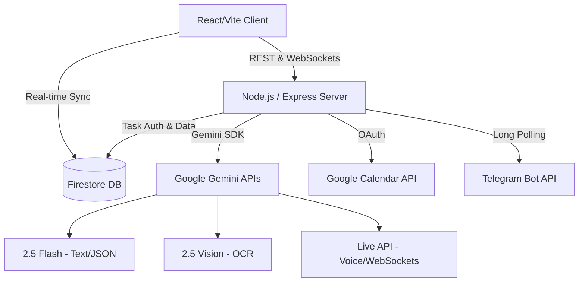

<div align="center">

# 🧭 Saarthi

**The Behavioral Execution Platform for Ambitious Knowledge Workers**

[](#)
[](https://www.typescriptlang.org/)
[](https://reactjs.org/)
[](https://vitejs.dev/)
[](https://deepmind.google/technologies/gemini/)
[](https://opensource.org/licenses/MIT)

[Live Demo](#) · [Documentation](#) · [Report Bug](#) · [Request Feature](#)

</div>

---

## 📖 Executive Overview

**Saarthi** is an AI Execution Operating System. It is an adaptive engine built to solve a specific, pervasive problem: **the execution gap**.

The market is saturated with software that optimizes planning. Todoist, Motion, Notion, and Google Tasks are excellent at storing information. But people rarely fail because they forgot. They fail due to procrastination, overwhelm, perfectionism, poor estimation, momentum collapse, or burnout. 

Traditional software manages time. **Saarthi manages execution.**

Powered by the **Google Gemini ecosystem** and deeply integrated with **Google Workspace** and **Telegram**, Saarthi bridges the gap between static planning and real-time completion. It is a system that learns your behavior, predicts execution risk, and autonomously recalculates your path forward.

---

## 🚨 The Problem

Traditional productivity tools—planners, calendars, and to-do lists—make a fatal assumption: they assume humans are perfectly disciplined robots. 

- **Passive Storage:** Tasks are stored. Deadlines are recorded. But when friction spikes, no strategic breakdown is provided.
- **Unreactive Alerts:** A notification pings when it's too late. The friction of starting leads to avoidance.
- **Momentum Collapse:** When you fall behind, traditional systems just turn tasks red. The mental burden of rescheduling causes execution paralysis, leading to missed objectives or severe burnout.

### The Saarthi Philosophy
Saarthi exists to help you **finish work**, not simply organize it. It shifts the burden of planning, risk calculation, and recovery from the human to the AI, ensuring that no matter how chaotic life gets, you always have a viable, actionable path to completion.

---

## ✨ The Five Hero Capabilities

Saarthi's architecture revolves around five flagship capabilities that ensure execution.

### 1. Brain Dump (Messy Thoughts to Structured Commitments)
Capture chaotic, unstructured intentions via text, voice, or image. Input a vague objective or upload a photo of a whiteboard, and Saarthi's AI engine extracts the underlying requirements, instantly transforming them into structured, trackable commitments.

### 2. Adaptive AI Planning (Goals to Execution Plans)
Saarthi autonomously decomposes massive, overwhelming goals into realistic execution plans. It breaks down complex commitments into minute-by-minute subtasks, perfectly sized to bypass procrastination and build immediate momentum.

### 3. Execution Activation (Overcoming Paralysis)
When Saarthi detects execution paralysis or momentum loss, the Activation Engine intervenes. It doesn't just remind you to work; it generates tiny, frictionless starting points. It negotiates the smallest possible step to simply help you *begin*.

### 4. Recovery OS (Rebuilding the Week)
When life goes wrong and deadlines become mathematically impossible, Saarthi doesn't just turn tasks red. The Recovery OS generates a Compromise Strategy—instructing you exactly what to skip, what to condense, and how to deliver the maximum value in the remaining time.

### 5. Behavioral Intelligence (Continuous Adaptation)
Saarthi continuously learns how you actually work. It monitors focus patterns, completion rates, and fatigue levels, building a private Learning Profile. Every future plan, schedule, and intervention is optimized against your historical behavior.

---

## 🌐 The Supporting Ecosystem

These core capabilities are powered by a robust ecosystem of integrated technologies:

- **Predictive Risk Engine:** Continuously computes the mathematical probability of completion in real-time, shifting commitments between Secured, Caution, and Critical zones.
- **Continuous Voice Coaching:** A low-latency, WebSocket-powered Gemini Live integration provides real-time consultation. Brainstorm, update states, or overcome blocks through conversation.
- **Telegram Companion:** A dedicated integration delivers critical alerts, daily briefings, evening reflections, and interactive recovery plans directly to your phone.
- **Google Calendar Synchronization:** Extracted milestones are seamlessly provisioned and synchronized with your Google Calendar.
- **Insights & Analytics:** Deep analytics on your execution velocity, focus blocks, and behavioral trends.

---

## 🏛️ System Architecture

Saarthi is a production-grade full-stack platform engineered for scale and speed.



### AI Architecture

- **Gemini 2.5 Flash:** The core reasoning engine. Used for high-speed, structured JSON generation, task decomposition, and behavioral analysis.
- **Gemini Live API (WebSockets):** Maintains a stateful, low-latency audio stream for conversational coaching, equipped with tool-calling capabilities to modify database state autonomously.
- **Gemini 2.5 Flash Vision:** Processes complex unstructured images (syllabi, schedules) into actionable structured payloads.

---

## 💻 Technology Stack

| Domain | Technologies |
| :--- | :--- |
| **Frontend** | React 18, TypeScript, Vite, Tailwind CSS, Lucide Icons |
| **Backend** | Node.js, Express, TypeScript, tsx, esbuild |
| **AI Ecosystem** | `@google/genai` (Gemini 2.5 Flash, Vision, Live) |
| **Database & Auth** | Firebase Authentication, Cloud Firestore |
| **Integrations** | Google Workspace (Calendar APIs), Telegram Bot API |

---

## 📂 Repository Structure

```text
saarthi/
├── docs/                      # Architecture & Product Documentation
├── src/                       
│   ├── components/            # React UI Components
│   ├── lib/                   # Utility configurations (Firebase, OAuth)
│   ├── services/              # Core business logic (Behavioral Engine, AI Planners)
│   ├── App.tsx                # Main application entry point
│   ├── index.css              # Global Tailwind styling
│   └── types.ts               # Shared TypeScript interfaces
├── server.ts                  # Express backend entry point
├── firestore.rules            # Security rules for database access
├── package.json               # Build and dependency scripts
└── vite.config.ts             # Vite bundler configuration
```

---

## 🚀 Installation & Local Development

### 1. Prerequisites
- Node.js (v18+)
- Firebase Project (Firestore & Authentication enabled)
- Google Cloud Console Project (for Calendar OAuth and Gemini APIs)
- Telegram Bot Token (via BotFather)

### 2. Clone and Install
```bash
git clone https://github.com/your-org/saarthi.git
cd saarthi
npm install
```

### 3. Environment Configuration
Copy `.env.example` to `.env` and populate your secrets:
```env
GEMINI_API_KEY=your_gemini_api_key
VITE_FIREBASE_API_KEY=your_firebase_api_key
TELEGRAM_BOT_TOKEN=your_telegram_bot_token
```

### 4. Firebase Configuration
Ensure your `firebase-applet-config.json` points to your active Firebase project.

### 5. Start Development Server
```bash
npm run dev
```
*The Express backend will start alongside the Vite HMR middleware on port 3000.*

---

## ☁️ Deployment

Saarthi is configured for seamless deployment to containerized environments (like Google Cloud Run).

### Production Build
```bash
npm run build
```
*This command uses Vite to bundle the frontend and `esbuild` to compile the Express backend into a standalone `dist/server.cjs` file, radically reducing cold-start times.*

### Start Production Server
```bash
npm run start
```

---

## 🛡️ Security & Privacy

- **Client-Side Secrets:** Gemini API keys and Telegram tokens are securely housed on the Node.js backend. The frontend communicates exclusively via proxied `/api/*` routes.
- **Database Rules:** Strict `firestore.rules` ensure users can only read, write, and query documents associated with their authenticated `userId`.
- **OAuth Scopes:** Google Workspace integration requires explicit user consent, utilizing minimal scope permissions.

---

## 🔮 Future Roadmap

- **Multi-Agent Collaboration:** Enabling multiple users to share an execution space where Gemini delegates responsibilities based on individual team member velocity.
- **Deep Integration:** Automatic GitHub PR scanning to update engineering execution progress.
- **Advanced Telemetry:** Wearable API integration to correlate physiological stress data with execution risk scores.

---

## 🏆 Market Differentiation

Traditional software manages tasks. **Saarthi manages execution.**

While traditional applications wait passively for user input, Saarthi calculates degradation, anticipates failure, and pushes actionable recovery strategies via multiple channels before the crisis becomes unmanageable. It is a completely new category of behavioral software.

---

## 🤝 Contribution

We welcome contributions from the community. Please read our `CONTRIBUTING.md` for guidelines on pull requests, code standards, and issue tracking.

---

## 📄 License

This project is licensed under the **MIT License**. See the `LICENSE` file for details.

---

<div align="center">
  <p>Engineered for high-stakes execution.</p>
</div>
