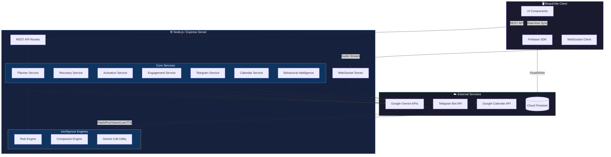
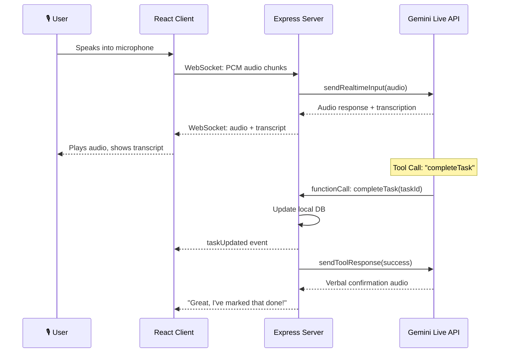

<div align="center">

# 🧭 Saarthi — सारथी

### The AI Execution Operating System for Ambitious Knowledge Workers

*Stop organizing. Start finishing.*

<br/>

[](https://www.typescriptlang.org/)
[](https://react.dev/)
[](https://vitejs.dev/)
[](https://nodejs.org/)
[](https://deepmind.google/technologies/gemini/)
[](https://firebase.google.com/)
[](LICENSE)
[](CONTRIBUTING.md)

<br/>

### 📑 Documentation Hub

| [🏗️ Architecture](ARCHITECTURE.md) | [📡 API](API_REFERENCE.md) | [☁️ Deploy](DEPLOYMENT.md) | [🤖 Telegram](TELEGRAM_SETUP.md) | [🧠 Models](GEMINI_MODELS.md) | [📊 Behaviors](BEHAVIORAL_ENGINE.md) |
| :---: | :---: | :---: | :---: | :---: | :---: |

<br/>

---

**Saarthi** is not a to-do list. It is an **AI-powered behavioral execution engine** that decomposes goals, predicts failure, intervenes emotionally, and rescues deadlines — all powered by **Google Gemini** and deeply integrated with **Google Workspace** and **Telegram**.

---

</div>

<br/>

## 📑 Table of Contents

- [The Problem](#-the-problem)
- [How Saarthi Works](#-how-saarthi-works)
- [Core Execution Systems](#-core-execution-systems)
- [Feature Matrix](#-complete-feature-matrix)
- [AI Models & Capabilities](#-ai-models--capabilities)
- [System Architecture](#-system-architecture)
- [Technology Stack](#-technology-stack)
- [Repository Structure](#-repository-structure)
- [Getting Started](#-getting-started)
- [API Reference](#-api-reference)
- [Environment Variables](#-environment-variables)
- [Deployment](#-deployment)
- [Security & Privacy](#-security--privacy)
- [Documentation](#-documentation)
- [Roadmap](#-roadmap)
- [Contributing](#-contributing)
- [License](#-license)

<br/>

---

## 🚨 The Problem

The productivity tool market is saturated with software that optimizes **planning** — Todoist, Motion, Notion, and Google Tasks are excellent at *storing* information. But people rarely fail because they forgot.

They fail because of:

| Failure Mode | What Happens | Traditional Tool Response |
|:---|:---|:---|
| **Procrastination** | Friction of starting leads to avoidance loops | ❌ Silent — no intervention |
| **Overwhelm** | Large goals create executive function paralysis | ❌ Shows a wall of tasks |
| **Poor Estimation** | Time estimates are off by 2-5x on average | ❌ Static deadlines turn red |
| **Momentum Collapse** | Falling behind creates shame spirals | ❌ More red badges, more guilt |
| **Perfectionism** | "All or nothing" thinking blocks partial progress | ❌ No scope negotiation |
| **Burnout** | Sustained overcommitment causes total shutdown | ❌ Keeps pushing notifications |

> **Saarthi's Philosophy:** The problem is never the plan. The problem is the gap between the plan and the human executing it. Saarthi exists to **close that gap**.

<br/>

---

## 🧠 How Saarthi Works

```
┌──────────────┐    ┌──────────────┐    ┌──────────────┐    ┌──────────────┐
│   You add a  │───▶│  AI breaks   │───▶│  Risk Engine  │───▶│  Saarthi     │
│  commitment  │    │  it into     │    │  monitors     │    │  intervenes  │
│              │    │  micro-steps │    │  24/7         │    │  proactively │
└──────────────┘    └──────────────┘    └──────────────┘    └──────────────┘
                                                                   │
                    ┌──────────────┐    ┌──────────────┐           │
                    │  Behavioral  │◀───│  Recovery OS  │◀──────────┘
                    │  Memory      │    │  activates    │
                    │  learns YOU  │    │  when needed  │
                    └──────────────┘    └──────────────┘
```

1. **Input** a goal, deadline, or photograph of a syllabus
2. Gemini **decomposes** it into time-estimated micro-tasks
3. The **Risk Engine** continuously computes completion probability
4. When risk rises, Saarthi **intervenes** — via chat, voice, or Telegram
5. If deadlines become impossible, the **Recovery OS** generates compromise strategies
6. Everything feeds into **Behavioral Memory** to personalize future plans

<br/>

---

## ⚡ Core Execution Systems

### 1. 🎯 Adaptive Planning Engine
> *"Tell me your goal. I'll build the roadmap."*

- Autonomously decomposes massive goals into minute-estimated micro-subtasks
- Plans evolve daily — not static schedules that break on Day 2
- Supports 7 planning strategies: `balanced`, `deep_work`, `deadline_first`, `energy_optimized`, `recovery_optimized`, `sprint_mode`, `minimal_survival`
- OCR-powered: photograph a syllabus or timetable and Saarthi extracts every commitment automatically
- Google Calendar bi-directional synchronization via OAuth

### 2. 🛡️ Activation Engine & Emotional Intelligence
> *"I'm stuck." → "Just open the textbook. That's it. 30 seconds."*

- Detects execution paralysis and "stuck" tasks via deterministic heuristics
- Generates ridiculously small **Micro Missions** (30s–5min) to break procrastination
- "Shrink it" mode: if the micro-action still feels too big, it generates an even smaller one
- Tracks momentum, streaks, and activation analytics
- Emotionally calibrated tone — recognizes overwhelm and responds with empathy, not pressure

### 3. 🔄 Recovery OS & Decision Matrix
> *"I ruined my week." → "Let's rebuild. Drop Feature X. Secure the passing grade."*

- Activates when deadlines become mathematically impossible
- Generates **Compromise Strategies**: `reduce_scope`, `delay`, `split`, `skip`, `compress`
- 4 recovery modes: `minimal`, `balanced`, `maximum`, `wellness`
- Before/after confidence scoring with stress reduction estimates
- One-click execution: applies the recovery plan to all affected tasks

### 4. 📊 Behavioral Intelligence & Memory
> *"You always procrastinate on Fridays. Let's move this deadline."*

- Builds a private **Learning Profile** from 20+ behavioral events
- Tracks: preferred work hours, focus duration, estimation accuracy, procrastination patterns, coaching style preferences
- Every future plan is optimized against your historical behavior
- Fully deterministic — no black box, every decision is auditable

### 5. 🤖 Adaptive Companion System
> *Five AI personalities that evolve with you.*

| Companion | Style | Best For |
|:---|:---|:---|
| 🛡️ **Guardian** | Gentle, supportive, empathetic | Anxiety, overwhelm, first-time users |
| ⚔️ **Commander** | Direct, no-nonsense, deadline-focused | High accountability, time pressure |
| 🧩 **Strategist** | Analytical, data-driven, systematic | Complex projects, optimization |
| 🎓 **Mentor** | Educational, patient, growth-focused | Skill building, long-term goals |
| 🏋️ **Challenger** | Competitive, high-energy, gamified | Gamification lovers, competitive types |

The companion **auto-adapts**: if you're overwhelmed and using Commander, Saarthi will automatically switch to Guardian. If you're highly engaged with low-density settings, it increases communication frequency.

### 6. 📡 Adaptive Engagement Engine
> *"You've ignored 3 notifications. I'll back off for 6 hours."*

- Real-time engagement scoring (0–100) with time-based decay
- 6 behavioral states: `highly_engaged`, `building_momentum`, `passive`, `overwhelmed`, `burned_out`, `deadline_crisis`
- Intelligent notification back-off: T1 (2h) → T2 (6h) → T3 (12h lockout)
- Quiet hours with cross-midnight support
- Burnout signal detection and automatic intervention scaling

### 7. ⚙️ Deterministic Scheduling & Execution Operating Engine (Phases 1–10)
> *"Guaranteed non-negotiable deadline enforcement with ZERO black-box randomness."*

- **Dependency DAG Engine (Phase 1)**: Topological sort (Kahn's algorithm) & 3-color DFS cycle detection in `src/lib/dependencyGraph.ts`. Prerequisite tasks inherit priority elevation from downstream critical commitments.
- **Deterministic Scheduler (Phase 2)**: Rule-based non-overlapping slot allocation (09:00–22:00 windows) in `src/services/deterministicSchedulerService.ts`. Explicit `CONFLICT` detection on impossible hard deadlines.
- **Automatic Event Rescheduler (Phase 3)**: Event-driven schedule repair in `src/services/reschedulingService.ts`. Automatically reacts to `TASK_DELAYED`, `TASK_COMPLETED_EARLY`, `TASK_MISSED`, and `DEPENDENCY_CHANGED` triggers.
- **Google Calendar Integration (Phase 4)**: Bi-directional free/busy slot awareness with `Saarthi Exec:` metadata loop protection in `src/services/calendarService.ts`.
- **Commitment Semantics & Bills (Phase 5)**: Canonical `HARD` vs `FLEXIBLE` commitments in `src/services/taskService.ts`. Automatic $+35$ risk score escalation on overdue bills and zero-duplicate subscription renewals.
- **Notification Escalation Engine (Phase 6)**: Monotonic stage transitions (`UPCOMING` $\rightarrow$ `APPROACHING` $\rightarrow$ `URGENT` $\rightarrow$ `CRITICAL` $\rightarrow$ `OVERDUE`) in `src/services/notificationService.ts`.
- **100% Deterministic Adaptive Metrics (Phase 7)**: Pure mathematical completion/on-time calculation in `src/services/adaptivePlanningService.ts` with zero `Math.random()`.
- **Master Production Suite (Phases 8–10)**: 10 test suites / 143 tests passing (100% pass rate) with atomic database writes, crash recovery, and graceful shutdown handling.

<br/>

---

## 📋 Complete Feature Matrix

| Category | Feature | Details |
|:---|:---|:---|
| **Planning** | AI Task Decomposition | Gemini breaks goals into subtasks with time estimates |
| | OCR Commitment Extraction | Photograph a syllabus → structured commitments |
| | Adaptive Scheduling | 7 strategies, preferred hours, max focus duration |
| | Smart Context Reminders | AI-generated next steps, resource suggestions, draft templates |
| **Execution** | Micro Mission Generator | 30s–5min atomic actions to break paralysis |
| | Stuck Task Detection | Deterministic heuristics: deadline proximity, velocity, complexity |
| | Momentum Tracking | Streaks, focus minutes, activation analytics |
| | Session Timer | Pomodoro-style focus sessions with completion tracking |
| **Risk & Recovery** | Real-time Risk Scoring | Multi-factor: velocity, buffer ratio, complexity, missed sessions |
| | 3-Zone Classification | Safe → Watch → Critical with visual indicators |
| | Recovery Plan Generation | AI compromise strategies with confidence deltas |
| | One-click Recovery Execution | Apply recovery plan to all affected tasks |
| **AI Chat** | Multi-persona Chat | 3 built-in personas + custom companion profile |
| | Google Search Grounding | Real-time web search for up-to-date answers |
| | Deep Thinking Mode | Gemini 3.1 Pro with HIGH thinking level |
| | Text-to-Speech | 5 voice options (Puck, Charon, Kore, Fenrir, Zephyr) |
| **Voice** | Gemini Live Voice | Real-time voice coaching via WebSockets |
| | Live Tool Calling | Voice commands: complete tasks, snooze, get status |
| | Input/Output Transcription | Real-time transcripts of both user and AI speech |
| | Interruption Support | Natural conversation with barge-in capability |
| **Integrations** | Google Calendar Sync | OAuth-based bi-directional event synchronization |
| | Telegram Companion Bot | Full-featured bot with linking, briefings, alerts |
| | Daily Briefings | AI morning briefings & evening reflections |
| | Recovery Alerts | Automatic critical-risk alerts to Telegram |
| **Personalization** | AI Image Generation | Gemini-powered custom motivation wallpapers |
| | Companion Onboarding | 5-step personality quiz for AI companion |
| | Custom API Keys | Bring your own Gemini API key |
| | Quiet Hours | Configurable notification blackout periods |
| **Behavioral** | Learning Profile | 20+ learned attributes with confidence scoring |
| | 28 Event Types | Comprehensive behavioral event tracking |
| | Engagement Decay | Automatic score decay after 24h inactivity |
| | Companion Auto-Adaptation | AI personality shifts based on engagement state |

<br/>

---

## 🤖 AI Models & Capabilities

Saarthi leverages the full spectrum of Google Gemini models:

| Model | Use Case | Invocation |
|:---|:---|:---|
| `gemini-3.1-pro-preview` | Complex reasoning, deep thinking, search grounding | Chat (complex queries) |
| `gemini-3.5-flash` | Briefings, engagement-calibrated content | Daily briefings |
| `gemini-3.1-flash-lite` | Fast structured JSON generation | Task decomposition, micro actions |
| `gemini-3.1-flash-live-preview` | Real-time voice coaching with tool calling | Gemini Live voice sessions |
| `gemini-3.1-flash-tts-preview` | Text-to-Speech synthesis | TTS playback (5 voices) |
| `gemini-3-pro-image-preview` | High-res AI image generation | Motivation wallpapers |
| `gemini-2.5-flash-image` | Fallback image generation | Image gen fallback cascade |
| Gemini Vision (Flash) | OCR & document analysis | Syllabus/timetable photo parsing |

**Cascade Fallback Strategy**: Image generation cascades through `gemini-3-pro-image-preview` → `gemini-2.5-flash-image` → curated Unsplash aesthetics, ensuring zero downtime.

<br/>

---

## 🏗️ System Architecture



### Gemini Live Voice Architecture



<br/>

---

## 💻 Technology Stack

| Layer | Technologies |
|:---|:---|
| **Frontend** | React 19, TypeScript 5.8, Vite 6, Tailwind CSS 4, Motion (Framer), Lucide Icons, Recharts |
| **Backend** | Node.js 18+, Express 4, WebSockets (ws), tsx, esbuild |
| **AI Engine** | `@google/genai` — Gemini 3.1 Pro, Flash, Flash Lite, Live, TTS, Vision, Image |
| **Database** | Firebase Cloud Firestore (named database), Firebase Admin SDK |
| **Authentication** | Firebase Authentication (Google OAuth) |
| **Integrations** | Google Calendar API (OAuth 2.0), Telegram Bot API (Webhooks + Long Polling) |
| **Build Tools** | Vite (frontend), esbuild (backend), TypeScript Compiler |
| **Styling** | Tailwind CSS v4 with `@tailwindcss/vite` plugin |

<br/>

---

## 📂 Repository Structure

```
saarthi/
├── 📄 server.ts                        # Express backend — API routes, WebSocket bridge, Telegram worker
├── 📄 index.html                       # SPA entry point
├── 📄 package.json                     # Dependencies & scripts
├── 📄 vite.config.ts                   # Vite bundler + Tailwind plugin
├── 📄 tsconfig.json                    # TypeScript configuration
├── 📄 firebase.json                    # Firebase project configuration
├── 📄 firebase-applet-config.json      # Client-side Firebase config (projectId, apiKey, etc.)
├── 📄 firebase-blueprint.json          # Firestore schema blueprint (entities & collections)
├── 📄 firestore.rules                  # Firestore security rules
├── 📄 .env.example                     # Environment variable template
├── 📁 docs/                            # Extended documentation (see below)
│   ├── ARCHITECTURE.md                 # Deep-dive system architecture
│   ├── API_REFERENCE.md                # Complete REST & WebSocket API docs
│   ├── DEPLOYMENT.md                   # Production deployment guide
│   ├── TELEGRAM_SETUP.md              # Telegram bot setup & linking
│   ├── GEMINI_MODELS.md               # AI model selection & configuration
│   └── BEHAVIORAL_ENGINE.md           # Behavioral intelligence internals
├── 📁 src/
│   ├── 📄 App.tsx                      # Main React application (213KB — full SPA)
│   ├── 📄 main.tsx                     # React DOM entry point
│   ├── 📄 index.css                    # Global Tailwind styling
│   ├── 📄 types.ts                     # 295 lines of shared TypeScript interfaces
│   ├── 📁 components/                  # React UI Components
│   │   ├── LandingPage.tsx             # Marketing landing page (93KB)
│   │   ├── AssistantPanel.tsx          # AI chat panel with personas (45KB)
│   │   ├── SettingsModal.tsx           # User settings & integrations (44KB)
│   │   ├── TaskCard.tsx                # Task display with risk indicators (37KB)
│   │   ├── RecoveryCenter.tsx          # Recovery OS interface (20KB)
│   │   ├── ActivationCenter.tsx        # Micro-mission launcher (11KB)
│   │   ├── CompanionCenter.tsx         # AI companion management (10KB)
│   │   ├── CompanionOnboarding.tsx     # 5-step companion personality quiz (9KB)
│   │   ├── LearningCenter.tsx          # Behavioral profile viewer (10KB)
│   │   ├── AdaptivePlanningCenter.tsx  # Planning strategy dashboard (9KB)
│   │   ├── EngagementInsights.tsx      # Engagement analytics (8KB)
│   │   ├── OCRReviewModal.tsx          # OCR extraction review (10KB)
│   │   └── SyllabusAnalyzer.tsx        # Photo-to-task converter (7KB)
│   ├── 📁 services/                    # Core Business Logic
│   │   ├── plannerService.ts           # Task decomposition & scheduling (23KB)
│   │   ├── telegramService.ts          # Full Telegram bot implementation (97KB)
│   │   ├── engagementService.ts        # Engagement scoring & briefings (15KB)
│   │   ├── recoveryService.ts          # Recovery plan generation (9KB)
│   │   ├── calendarService.ts          # Google Calendar sync (9KB)
│   │   ├── behavioralIntelligenceService.ts # Learning profile builder (8KB)
│   │   ├── activationService.ts        # Micro-mission generator (7KB)
│   │   ├── localDb.ts                  # Server-side JSON data store (5KB)
│   │   ├── taskService.ts              # Task CRUD operations (3KB)
│   │   ├── geminiCall.ts               # Gemini API retry & fallback (2KB)
│   │   ├── errorHandler.ts             # Centralized error handling (2KB)
│   │   └── jsonUtils.ts                # JSON parsing utilities (1KB)
│   ├── 📁 lib/                         # Utility Libraries
│   │   ├── riskEngine.ts               # Deterministic risk scoring (7KB)
│   │   ├── companionEngine.ts          # Companion auto-adaptation logic (2KB)
│   │   └── firebase.ts                 # Firebase client initialization (2KB)
│   ├── 📁 hooks/                       # React Hooks
│   │   ├── useDebounce.ts              # Debounce utility hook
│   │   └── useMediaQuery.ts            # Responsive breakpoint hook
│   ├── 📁 utils/                       # Utility Functions
│   │   └── cn.ts                       # Class name merge utility
│   └── 📁 constants/                   # Application Constants
│       └── index.ts                    # App-wide constants
└── 📁 assets/                          # Static assets (images, icons)
```

<br/>

---

## 🚀 Getting Started

### Prerequisites

| Requirement | Version | Purpose |
|:---|:---|:---|
| **Node.js** | v18+ | Runtime |
| **npm** | v9+ | Package manager |
| **Firebase Project** | — | Firestore database + Auth |
| **Google Cloud Project** | — | Gemini API + Calendar OAuth |
| **Telegram Bot Token** | — | Companion bot (optional) |

### 1. Clone & Install

```bash
git clone https://github.com/LavSarkari/saarthi.git
cd saarthi
npm install
```

### 2. Configure Environment

```bash
cp .env.example .env
```

Edit `.env` with your credentials:

```env
# Required — powers all AI features
GEMINI_API_KEY=your_gemini_api_key

# Required for production — auto-injected in AI Studio
APP_URL=https://your-deployed-url.com

# Optional — enables Telegram companion bot
TELEGRAM_BOT_TOKEN=your_telegram_bot_token
```

### 3. Configure Firebase

Ensure `firebase-applet-config.json` contains your Firebase project credentials:

```json
{
  "projectId": "your-project-id",
  "appId": "your-app-id",
  "apiKey": "your-api-key",
  "authDomain": "your-project.firebaseapp.com",
  "storageBucket": "your-project.firebasestorage.app",
  "messagingSenderId": "your-sender-id",
  "firestoreDatabaseId": "your-named-database-id"
}
```

> **⚠️ Important:** If your Firebase project uses a named Firestore database (not `(default)`), you **must** include the `firestoreDatabaseId` field. Without it, the SDK will attempt to connect to `(default)` and fail.

### 4. Start Development Server

```bash
npm run dev
```

The Express backend + Vite HMR middleware will start on **http://localhost:3000**.

### 5. Available Scripts

| Script | Command | Description |
|:---|:---|:---|
| **Dev** | `npm run dev` | Start development server with HMR |
| **Build** | `npm run build` | Production build (Vite frontend + esbuild backend) |
| **Start** | `npm run start` | Run production server from `dist/` |
| **Lint** | `npm run lint` | TypeScript type checking |
| **Clean** | `npm run clean` | Remove build artifacts |

<br/>

---

## 📡 API Reference

All API routes are served from the Express backend on port 3000.

### Planning & AI

| Method | Endpoint | Description |
|:---|:---|:---|
| `POST` | `/api/gemini/task-planner` | Decompose a commitment into structured subtasks |
| `POST` | `/api/gemini/adaptive-schedule` | Generate an adaptive schedule from tasks + strategy |
| `POST` | `/api/gemini/reminder-context` | Generate smart context advice for a task |
| `POST` | `/api/gemini/analyze-syllabus` | Analyze a photo via Gemini Vision |
| `POST` | `/api/gemini/ocr-commitments` | Extract structured commitments from photos |

### Recovery

| Method | Endpoint | Description |
|:---|:---|:---|
| `POST` | `/api/gemini/recovery-plan` | Generate an AI recovery plan |
| `POST` | `/api/gemini/execute-recovery` | Apply a recovery plan to tasks |

### Chat & Voice

| Method | Endpoint | Description |
|:---|:---|:---|
| `POST` | `/api/gemini/chat` | Multi-turn AI chat with personas, search, thinking |
| `POST` | `/api/gemini/tts` | Text-to-Speech synthesis (5 voices) |
| `POST` | `/api/gemini/generate-image` | AI image generation with cascade fallback |
| `WS` | `/live` | Gemini Live voice coaching (WebSocket) |

### Telegram

| Method | Endpoint | Description |
|:---|:---|:---|
| `POST` | `/api/telegram/webhook` | Incoming Telegram updates |
| `POST` | `/api/telegram/generate-code` | Generate account linking code |
| `POST` | `/api/telegram/unlink` | Unlink Telegram account |
| `POST` | `/api/telegram/sync-state` | Sync client state with server |
| `GET` | `/api/telegram/get-state` | Fetch linking status + cached tasks |
| `POST` | `/api/telegram/trigger-briefing` | Trigger AI morning/evening briefing |
| `POST` | `/api/telegram/trigger-alert` | Trigger recovery alert for high-risk task |
| `GET` | `/api/telegram/debug` | Telegram bot diagnostics |

### Engagement & Activation

| Method | Endpoint | Description |
|:---|:---|:---|
| `GET` | `/api/engagement/status` | Get user engagement score & state |
| `POST` | `/api/engagement/quiet-hours` | Configure notification quiet hours |
| `POST` | `/api/engagement/overwhelm` | Register burnout signal |
| `GET` | `/api/engagement/briefing` | Generate AI morning/evening briefing |
| `GET` | `/api/activation/status` | Get activation analytics + active session |

> 📖 For complete request/response schemas, see [docs/API_REFERENCE.md](API_REFERENCE.md)

<br/>

---

## 🔐 Environment Variables

| Variable | Required | Description |
|:---|:---|:---|
| `GEMINI_API_KEY` | ✅ | Google Gemini API key for all AI features |
| `APP_URL` | 🔶 Production | Public URL for OAuth callbacks and Telegram webhooks |
| `TELEGRAM_BOT_TOKEN` | ❌ Optional | Telegram Bot API token from [@BotFather](https://t.me/BotFather) |
| `NODE_ENV` | ❌ Optional | Set to `production` for static file serving |
| `DISABLE_HMR` | ❌ Optional | Set to `true` to disable Vite HMR (for AI Studio) |

<br/>

---

## ☁️ Deployment

### Production Build

```bash
# Build frontend (Vite) + backend (esbuild)
npm run build

# Start production server
npm run start
```

The build process:
1. **Vite** bundles the React frontend into `dist/` with tree-shaking and code splitting
2. **esbuild** compiles `server.ts` into a standalone `dist/server.cjs` (CommonJS, external node_modules, sourcemaps)
3. The production server serves static files from `dist/` and handles API routes

### Recommended Platforms

| Platform | Notes |
|:---|:---|
| **Google Cloud Run** | Recommended — auto-scaling, HTTPS, Firebase integration |
| **Google AI Studio** | Built-in support — auto-injects `GEMINI_API_KEY` and `APP_URL` |
| **Railway / Render** | One-click deploy with environment variable support |
| **Docker** | Containerize with Node.js 18+ base image |

> 📖 For detailed deployment guides, see [docs/DEPLOYMENT.md](DEPLOYMENT.md)

<br/>

---

## 🛡️ Security & Privacy

| Concern | Implementation |
|:---|:---|
| **API Key Protection** | Gemini API keys are server-side only. Frontend communicates via proxied `/api/*` routes. |
| **Custom API Keys** | User-provided keys are sent via `x-gemini-api-key` header, never stored. |
| **Database Security** | Firestore rules enforce user-scoped read/write access via `userId` matching. |
| **OAuth Scopes** | Google Calendar integration uses minimal scope permissions with explicit user consent. |
| **Behavioral Data** | Learning profiles are per-user and never shared across accounts. |
| **Telegram Linking** | Account linking uses one-time codes with expiration. |
| **No Analytics** | Saarthi does not track, sell, or share any user data with third parties. |

<br/>

---

## 📖 Documentation

Extended documentation lives in the [`docs/`](docs/) folder — fully navigable on GitHub:

| Document | Description |
|:---|:---|
| [**ARCHITECTURE.md**](ARCHITECTURE.md) | Deep-dive into system architecture, data flows, and service interactions |
| [**API_REFERENCE.md**](API_REFERENCE.md) | Complete REST & WebSocket API with request/response schemas |
| [**DEPLOYMENT.md**](DEPLOYMENT.md) | Production deployment guide for Cloud Run, Docker, Railway |
| [**TELEGRAM_SETUP.md**](TELEGRAM_SETUP.md) | Step-by-step Telegram bot setup, linking flow, and daily digest configuration |
| [**GEMINI_MODELS.md**](GEMINI_MODELS.md) | AI model selection strategy, cascading, and cost optimization |
| [**BEHAVIORAL_ENGINE.md**](BEHAVIORAL_ENGINE.md) | Behavioral intelligence internals, learning profile attributes, and event types |

<br/>

---

## 🔮 Roadmap

- [x] Adaptive Planning Engine with 7 strategies
- [x] Recovery OS with compromise strategies
- [x] Gemini Live voice coaching with tool calling
- [x] Telegram companion bot with daily briefings
- [x] Adaptive companion personality system
- [x] Engagement engine with intelligent back-off
- [x] Behavioral intelligence & learning profiles
- [x] OCR commitment extraction from photos
- [x] AI image generation for motivation wallpapers
- [ ] 🔜 Multi-agent collaboration for teams
- [ ] 🔜 GitHub PR scanning for engineering progress tracking
- [ ] 🔜 Wearable API integration (stress × execution risk correlation)
- [ ] 🔜 Spaced repetition integration for study-focused workflows
- [ ] 🔜 Mobile app (React Native) with offline-first sync
- [ ] 🔜 Plugin system for custom integrations

<br/>

---

## 🤝 Contributing

We welcome contributions! Please see [CONTRIBUTING.md](CONTRIBUTING.md) for guidelines on:

- Pull request process
- Code standards (TypeScript strict mode, ESLint)
- Issue tracking and feature requests
- Development workflow

```bash
# Fork the repo, create a branch
git checkout -b feature/amazing-feature

# Make your changes, commit
git commit -m "feat: add amazing feature"

# Push and create a PR
git push origin feature/amazing-feature
```

<br/>

---

## 📄 License

This project is licensed under the **MIT License** — see the [LICENSE](LICENSE) file for details.

<br/>

---

<div align="center">

### Built with 🧠 by ambitious humans, for ambitious humans.

**Saarthi** — *Because the world doesn't need another to-do list.*

<br/>

[](../../stargazers)
[](https://github.com/LavSarkari)

</div>
