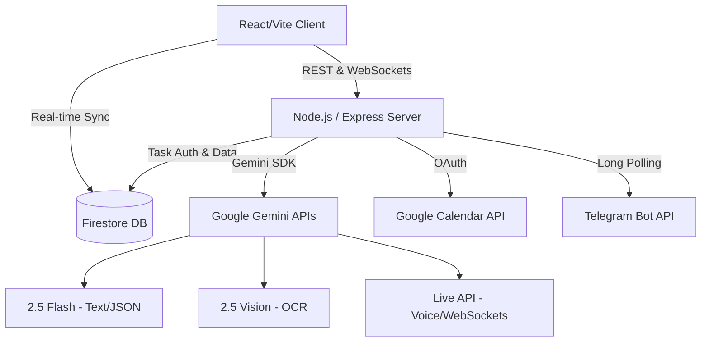

<div align="center">

# 🧭 Saarthi

**The Autonomous, AI-Powered Rescue Engine for High-Stakes Deadlines**

[](#)
[](https://www.typescriptlang.org/)
[](https://reactjs.org/)
[](https://vitejs.dev/)
[](https://deepmind.google/technologies/gemini/)
[](https://opensource.org/licenses/MIT)

[Live Demo](#) · [Documentation](#) · [Report Bug](#) · [Request Feature](#)

</div>

---

## 📖 Executive Summary

**Saarthi** is a professional-grade, autonomous execution engine built for individuals facing critical deadlines. Unlike traditional task managers that passively store lists of work, Saarthi actively monitors your schedule, decomposes complex tasks, predicts failure risks, and dispatches real-time recovery plans when deadlines compress. 

Powered by the **Google Gemini 2.5 ecosystem** (Flash, Vision, and Live APIs) and integrated deeply into **Google Workspace** and **Telegram**, Saarthi bridges the gap between static planning and real-time execution.

---

## 🚨 The Problem

Traditional productivity tools—planners, calendars, and to-do lists—fail when you need them most: **during a crisis.**
- **Passive Tracking:** They only tell you *what* is due, not *how* to do it when time is critically short.
- **Cognitive Overload:** When users fall behind, the mental friction of rescheduling and re-prioritizing leads to paralysis.
- **Siloed Environments:** Tasks live in an app, but life happens in calendars and messages. By the time you check your to-do list, it's often too late.

### Why Saarthi Exists
Saarthi was engineered to eliminate execution paralysis. It shifts the burden of planning, risk calculation, and recovery from the human to the AI, ensuring that no matter how close the deadline, you always have a viable, actionable path forward.

---

## ✨ Core Capabilities

### 1. Autonomous Decomposition (Gemini 2.5 Flash)
Input a vague objective (e.g., "Launch Product V2 next Friday"), and Saarthi autonomously decomposes it into an actionable, minute-by-minute execution plan with time constraints.

### 2. Predictive Risk Engine
Saarthi continuously monitors your remaining time against task complexity. Tasks dynamically shift between **Secured**, **Caution**, and **Critical** zones. If a task enters the Critical zone, Saarthi intervenes.

### 3. Automated Recovery Strategies
When a deadline becomes mathematically impossible under current constraints, Saarthi generates a **Compromise Strategy**—instructing you exactly what to skip, what to condense, and how to deliver the maximum value in the remaining time.

### 4. Continuous Voice Coaching (Gemini Live API)
A low-latency, WebSocket-powered voice assistant provides real-time consultation. Brainstorm ideas, dictate task updates, or ask for motivation. The Voice Engine executes server-side function calling to modify your schedule purely through conversation.

### 5. Multi-Channel Synchronization
- **Google Calendar Sync:** Extracted tasks and deadlines are automatically provisioned as Google Calendar events via OAuth.
- **Telegram Companion Bot:** A dedicated Telegram integration delivers critical push alerts, daily digests, and interactive recovery plans directly to your phone.

### 6. Vision-Based Extraction (Gemini Vision OCR)
Upload a photo of a whiteboard, syllabus, or handwritten note. Saarthi uses OCR to extract deadlines, estimate workloads, and build out your entire month's schedule instantly.

---

## 🗺️ End-to-End User Journey

1. **Ingestion:** User uploads a syllabus (Vision OCR) or types a vague goal.
2. **Decomposition:** Gemini 2.5 Flash structures the raw data into subtasks with precise time estimates.
3. **Synchronization:** The backend automatically pushes the structured agenda to Google Calendar.
4. **Monitoring:** The Risk Engine calculates real-time confidence scores based on remaining time.
5. **Intervention:** A task enters the "Critical" zone. 
6. **Alerting:** The Telegram Companion Bot pushes an instant alert to the user's phone.
7. **Recovery:** The user opens the web app (or replies via Telegram) to receive an AI-generated Compromise Plan.
8. **Execution:** The user executes the simplified subtasks, completing the project just in time.

---

## 🏛️ Technical Architecture

### High-Level System Design



### AI Architecture

- **Gemini 2.5 Flash:** Used for high-speed, structured JSON generation (task decomposition, recovery strategies).
- **Gemini Live API (WebSockets):** Maintains a stateful, low-latency audio stream for conversational coaching, equipped with tool-calling capabilities to modify database state.
- **Gemini 2.5 Flash Vision:** Processes complex unstructured images (syllabi, schedules) into structured JSON payloads.

---

## 💻 Technology Stack

| Domain | Technologies |
| :--- | :--- |
| **Frontend** | React 18, TypeScript, Vite, Tailwind CSS, Lucide Icons |
| **Backend** | Node.js, Express, TypeScript, tsx, esbuild |
| **AI Ecosystem** | `@google/genai` (Gemini 2.5 Flash, Vision, Live, Voice) |
| **Database & Auth** | Firebase Authentication, Cloud Firestore |
| **Integrations** | Google Workspace (Calendar APIs), Telegram Bot API |
| **State Management** | React Hooks, Context API, Local Volatile Cache (Node) |

---

## 📂 Repository Structure

```text
saarthi/
├── docs/                      # Technical Documentation
├── src/                       
│   ├── components/            # React UI Components
│   ├── lib/                   # Utility configurations (Firebase, OAuth)
│   ├── services/              # Core business logic (Gemini, Telegram, Engine)
│   ├── App.tsx                # Main application entry point
│   ├── index.css              # Global Tailwind styling
│   └── types.ts               # Shared TypeScript interfaces
├── server.ts                  # Express backend entry point
├── firestore.rules            # Security rules for database access
├── package.json               # Build and dependency scripts
└── vite.config.ts             # Vite bundler configuration
```

---

## 🚀 Installation & Local Development

### 1. Prerequisites
- Node.js (v18+)
- Firebase Project (Firestore & Authentication enabled)
- Google Cloud Console Project (for Calendar OAuth and Gemini APIs)
- Telegram Bot Token (via BotFather)

### 2. Clone and Install
```bash
git clone https://github.com/your-org/saarthi.git
cd saarthi
npm install
```

### 3. Environment Configuration
Copy `.env.example` to `.env` and populate your secrets:
```env
GEMINI_API_KEY=your_gemini_api_key
VITE_FIREBASE_API_KEY=your_firebase_api_key
TELEGRAM_BOT_TOKEN=your_telegram_bot_token
```

### 4. Firebase Configuration
Ensure your `firebase-applet-config.json` points to your active Firebase project.

### 5. Start Development Server
```bash
npm run dev
```
*The Express backend will start alongside the Vite HMR middleware on port 3000.*

---

## ☁️ Deployment

Saarthi is configured for seamless deployment to containerized environments (like Google Cloud Run) or static/serverless platforms.

### Production Build
```bash
npm run build
```
*This command uses Vite to bundle the frontend and `esbuild` to compile the Express backend into a standalone `dist/server.cjs` file.*

### Start Production Server
```bash
npm run start
```

---

## 🛡️ Security & Privacy

- **Client-Side Secrets:** Gemini API keys and Telegram tokens are securely housed on the Node.js backend. The frontend communicates exclusively via proxied `/api/*` routes.
- **Database Rules:** Strict `firestore.rules` ensure users can only read, write, and query documents associated with their authenticated `userId`.
- **OAuth Scopes:** Google Calendar integration requires explicit user consent, utilizing minimal scope permissions (`https://www.googleapis.com/auth/calendar.events`).

---

## ⚡ Performance Optimizations

- **Single-File Backend Compilation:** The backend is bundled into a single CommonJS file using `esbuild`, resolving all relative import paths at build time to dramatically reduce container cold-start times.
- **Volatile Caching:** The Node.js backend utilizes an in-memory JSON cache for Telegram routing, preventing redundant read operations to Firestore.
- **Optimistic UI:** The React frontend employs optimistic state updates for instantaneous perceived performance during heavy API calls.

---

## 📱 Mobile Support & Accessibility

Saarthi is fully responsive, utilizing Tailwind's mobile-first utility classes to ensure a seamless experience across desktop, tablet, and mobile devices. 
- **Touch Targets:** Minimum 44px hit areas on mobile.
- **Contrast Ratios:** Adherence to WCAG AA contrast guidelines for all text elements.
- **Semantic HTML:** Proper use of structural tags and ARIA labels.

---

## 📸 Interface Showcase

| Dashboard Overview | AI Voice Companion |
| :---: | :---: |
| *(Screenshot Placeholder)* | *(Screenshot Placeholder)* |
| **Risk Engine** | **Telegram Alerts** |
| *(Screenshot Placeholder)* | *(Screenshot Placeholder)* |

---

## 🔮 Future Roadmap

- **Multi-Agent Collaboration:** Enabling multiple users to share a workspace where Gemini delegates tasks based on individual team member velocity.
- **GitHub Integration:** Automatic PR scanning to update engineering task progress.
- **Advanced Telemetry:** Wearable API integration to correlate physiological stress data with task risk scores.

---

## 🏆 Why Saarthi is Different

Saarthi is not a "todo app wrapper" around an LLM. It is an **active system** that behaves like a Chief of Staff. 

While traditional applications wait for user input, Saarthi calculates degradation, anticipates failure, and pushes actionable recovery strategies via multiple channels (Web, Voice, Telegram, Calendar) before the crisis becomes unmanageable.

---

## 🤝 Contribution

We welcome contributions from the community. Please read our `CONTRIBUTING.md` for guidelines on pull requests, code standards, and issue tracking.

---

## 📄 License

This project is licensed under the **MIT License**. See the `LICENSE` file for details.

---

<div align="center">
  <p>Engineered with precision for the Google AI Hackathon.</p>
</div>
